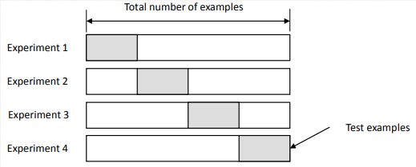

# MLG_Lab03

## 1. Explore the "hold_out_validation" notebook

### Q1. Determine where do we define all the above mentioned parameters

*Observe that we run the evaluation procedure on four different problems. Each problem is a two-class two-dimensional problem, where the two sets are more and more overlapped (e.g., the synthetic datasets are randomly generated using variances of 0.4, 0.5, 0.6 and 0.7).*

Les paramètres sont déclarés dans la partie *Experiment* du notebook.

### Q2. What are the cyan and red curves in those plots ? Why are they different ? 

La courbe cyan représente les phases d'entrainement du réseau de neuronne tandis que les courbes rouges représente les phases de test. Elles sont différentes à cause de l'imprécision du système qui n'est évidemment pas fiable à 100%.

### Q3. What happens with the training and test errors (MSE) when we have the two sets more overlapped ? 

Le système devient de moins en moins fiable et le MSE augmente. Un découpage linéaire est effectué, cependant un découpage de ce type n'est plus possible si les données sont mélangées.

### Q4. Why sometimes the red curves indicate a higher error than the cyan ones ? 

AUCUNE IDEE

### Q5. What is showing the boxplot summarizing the validation errors of the preceding experiments ? 

Ce sont les résultats des performances finales des courbes de test (rouge). Elles permettent d'observer que plus le problème est compliqué plus nous obtiendrons d'erreurs et que les résultats sont également plus éparpillés.

## 2. Explore the “cross_validation” notebook

### Q1. Determine where do we define all the above mentioned parameters.

Toujours dans la partie *Experiment*

### Q2. What is the difference between hold-out and cross-validation ? What is the new parameter that has to be defined for cross-validation ? 

La validation **hold-out** est séparée en 2 partie, la première étant les données d'entrainement tandis que la seconde est la partie de test. La **cross** validation contient `K` blocs. Un de ces blocs contient les données de tests tandis que les K-1 autres contiennent les données de tests.

Dans la validation hold-out, un seul passage est fait et les données d'entrainement sont situées avant les données de tests. Dans la cross validation, le bloc de test est déplacé et l'expérience est donc répété `K` fois de la manière suivante :

Le nouveau paramètre est la valeur `K`

### Q3. Observe the boxplots summarizing the validation errors obtained using the crossvalidation method and compare them with those obtained by hold-out validation. 

Comme pour le hold-out validation, le nombre d'erreur (MSE) est plus élevé losque la variance augmente. Cependant, avec le cross validation, on peut remarquer que les résultats des différentes itérations sont moins éparses et plus regroupés. Les résultats sont donc plus fiables que ceux obtenu avec le hold-out validation.