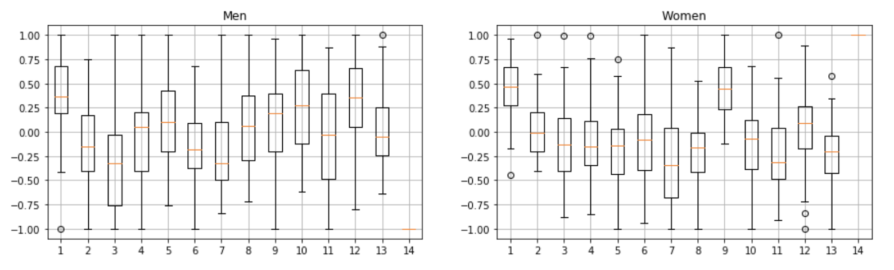
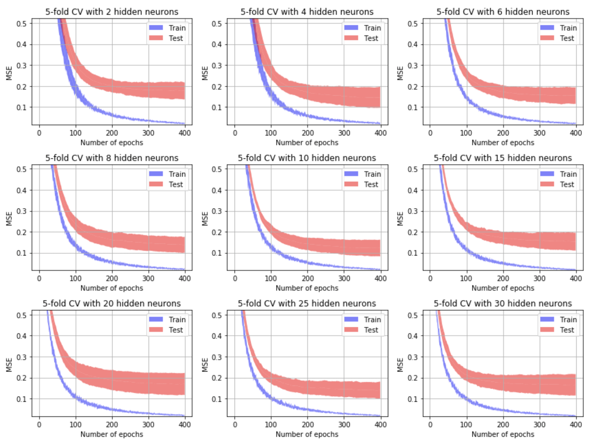
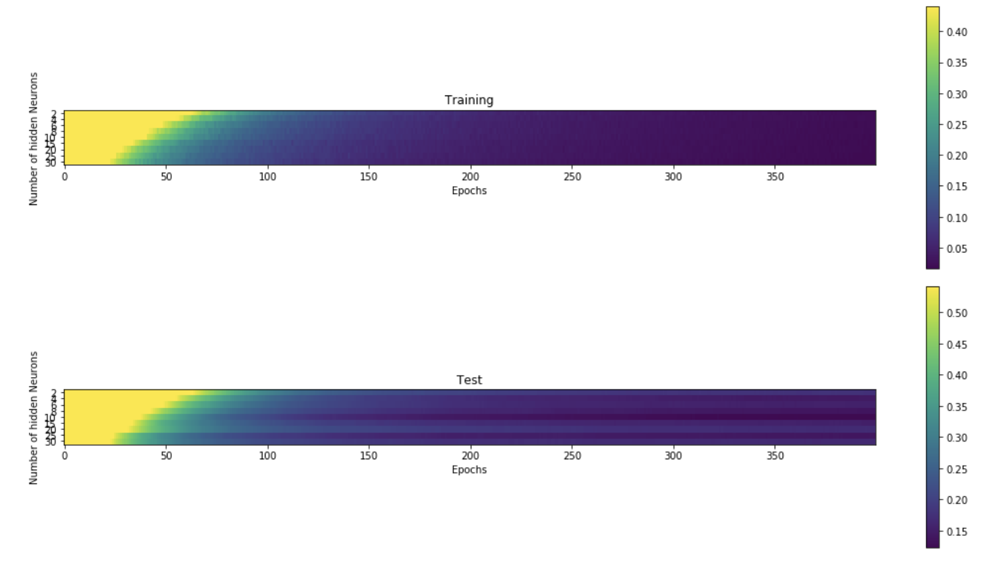
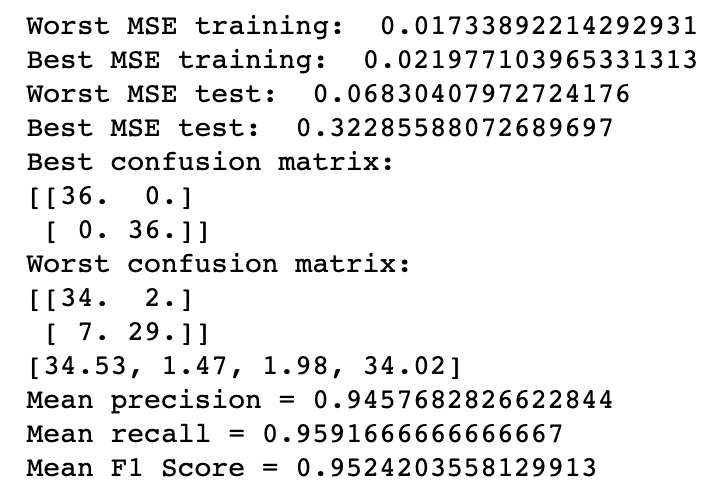

# Machine Learning

### Practical work 03 - Speaker recognition using Neural Networks and Supervised Learning

#### Auteurs : David Jaquet et Lionel Burgbacher

#### Github : https://github.com/djaquet5/MLG_Lab03

### Introduction 

Dans le cadre du projet 3 du cours machin learning, il nous a été demandé d'implémenter un petit logiciel permettant de classifier différents types de voix (homme, femme, enfant et ces mêmes types de façon syntétique) à l'ai du machin learning. Les coefficiants de MEL sont utilisés pour reconnaître les types de voix.  Nous avons donc instauré une procédure que nous avons appliqué dans les 4 cas. Une grande partie du code des précdents laboratoires a été réutilisé, nous l'avons modifier aux besoins. 

### 0. Procédure 

Pour simplifier la lecture du rapport, nous allors expliquer les différentes étapes appliquées et  expliquer , détailler les résultats dans les sections suivantes.

Tout d'abord, nous avons implémenter 3 types de clacules pour les features, un même fichier audio pouvant être divisé en plusieurs parties, il est donc important de ramener ces différentes parties à un seul. Pour cela, la moyenne, la médiane et la déviation standard ont été implémentés. La déviation standard ne donnant pas de résulat probant, nous l'avons ignoré. Nous n'avons pas constater de grosse différence entre la médian et la moyenne. Nous avons donc choisi : **jashdjasdjkajshdkja**

Une fois cette étape terminée, un terme a été ajouté aux données pour savoir si celle-ci était une voix d'homme ou de femme. Dans le cadre d'une sortie binaire et de la fonction d'activation (tanh()), l'homme coresspond donc à -1 et la femme à 1. Dans la partie à trois sorties, l'homme a [1,-1,-1], la femme a [-1,1,-1] et l'enfant a [-1, -1, 1].

Il reste maintenat à normalizer les données pour avoir un interval cohérent. Pour cela nous avons une fonction scale() qui permet de définir les bornes. Dans notre cas, -1 et 1.

Après plusieurs essaies ainsi que des recherches dans la litérature, nous n'avons pas trouver de rêgle élémentaire concernant le leraning rate (il y a un lien avec les EPOCHS) et le momentum. D'après la totalité de nos tests, les paramètres données par les anciens notebook sont les plus perfomants. Nous avons donc garder un learning rate de 0.001 et un momentum de 0.5.

Il est temps maintenant de passer au nombre d'Epoch en fonction des neurones. Pour déterminer ce nombre, on regarde la convergence des graphes pour ainsi optimiser ce nombre. 

### 1. Man vs Woman

- Après application de la moyenne, on voit qu'il y a certaines différences entre un homme et une femme. 

- On constate que sur l'image suivante, la convergence de la courbe se trouve autour des 400 EPOCHS.

  

- Il reste à définir le nombre de neurone dans la couche caché. D'après les graphes suivants, on choisis le nobre de neurones en fonction du nombre d'erreurs. On constate que **10** et **25** peuvent être de sérieux candidats. 

- 

- On peut aussi constater les résultats précédents à l'aide du grapique suivant. **10** et **25** restent les meilleurs choix.

  

- Nous pouvons résumer les réultats avec une matrice de confusion, ce qui permet aussi de valider nos paramètres ainsi que nos tests. Pour avoir un résultat cohérent, nous avons caclulé 100 fois cette matrice. Cela nous donne une meilleure vue d'ensemble qu'une simple iétaration. Nous avons donc le meilleur résulat, le pire et la matrice de confusion contenant la moyenne des 100 itérations.  

  

### 2. Man vs Woman (natural and synthetic)

### 3. Man vs Woman vs Children (natural and synthetic)

Dans cette partie du projet la seule différence de code notable est dans la partie du traitement de la matrice de confusion. 

### 4. Man natural vs Woman natural vs Man synthetic vs Woman synthetic

Comme le titre l'indique, nous avons choisi de différencier les sons naturels et synthétique entre homme et femme. Il faut donc avoir 4 sorties poour traiter ces données. Comme pour la partie 3, un ajustement a dû être fait pour la partie matrice de confusion. 

### Conclusion

Le laboratoire permet très concrètement de comprendre et d'appliquer une bonne partie des concepts vue en cours. Au fil du projet, beaucoup de questions sans réponse ont pu être résolues. On constate aussi qu'avec peu de donnée, le temps de exécution est très long. Nous avons eu beaucoup de plaisir à faire ce laboratoire. 